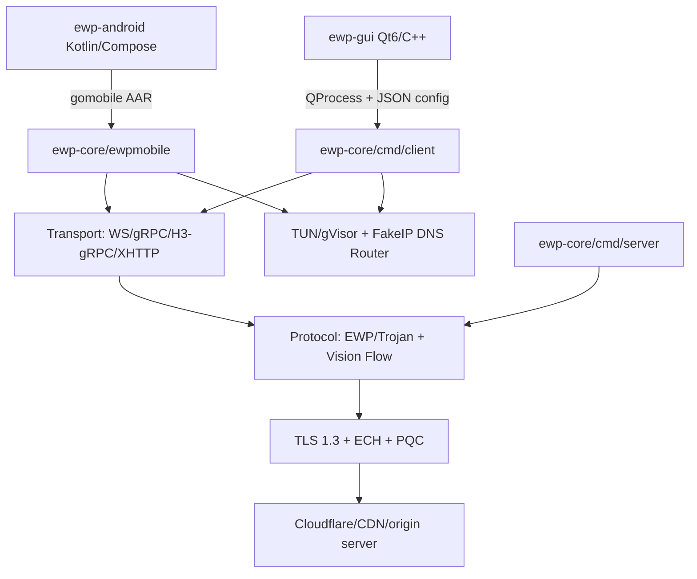
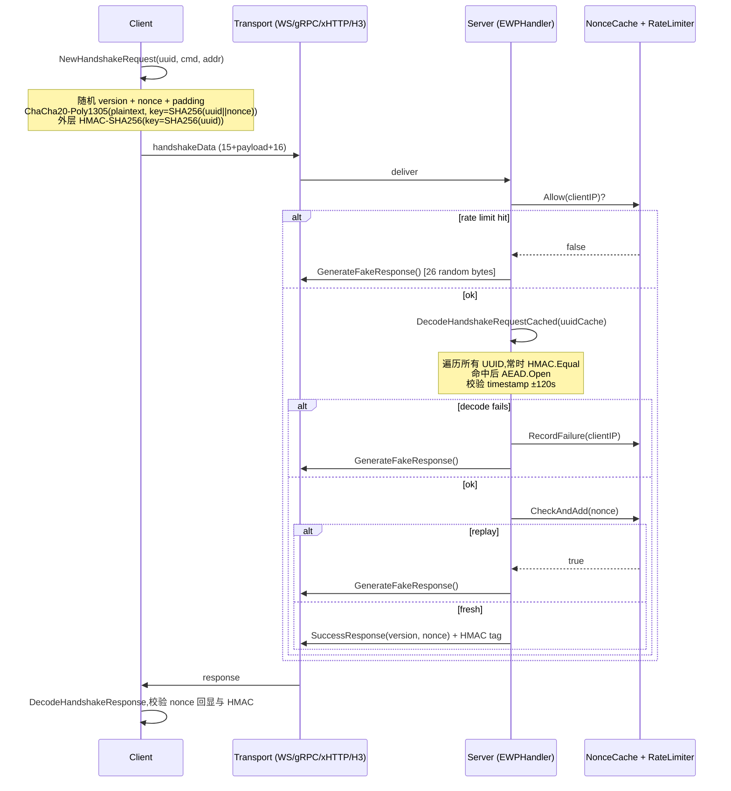
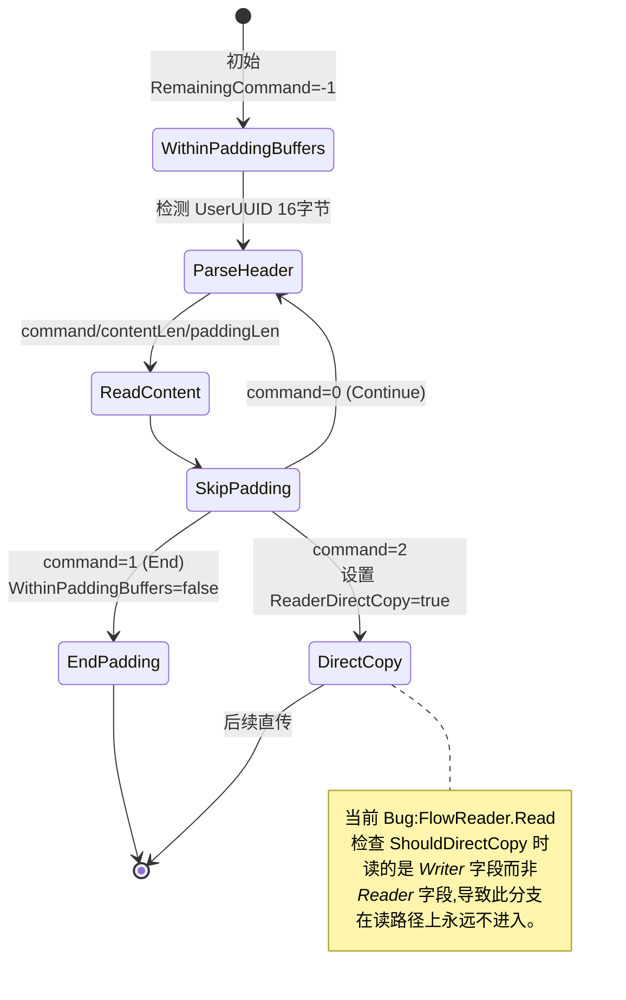
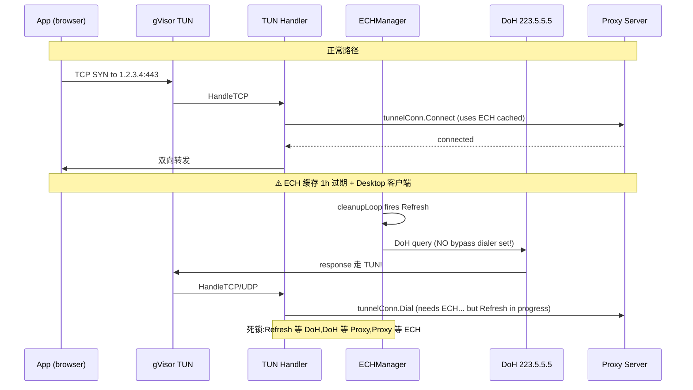

# ECH Workers 全栈安全与质量审计报告 (P0/P1/P2)

# ECH Workers 全栈安全与质量审计报告

## 0. 范围与方法

| 维度 | 内容 |
| --- | --- |
| 审计对象 | `ewp-core` (Go 用户态协议栈)、`ewp-gui` (Qt6/C++ 桌面)、`ewp-android` (Kotlin/Compose VPN) |
| 审计深度 | 关键路径深审 — 聚焦 TLS/ECH、协议解析、认证、TUN/VPN 数据面、UDP NAT、并发与生命周期 |
| 重点主题 | 数据面正确性 / 并发与资源 / DoS / 平台安全 |
| 优先级口径 | **P0** = 严重(可被远程利用 / 数据面可观察破损) · **P1** = 高(数据丢失、敏感信息泄露、易触发的 DoS) · **P2** = 中/低(代码质量、性能、防御深度) |
| 发现总数 | 约 **80+ 项**(P0:12 / P1:30 / P2:40) |

<user_quoted_section>审计未覆盖:测试代码、Browser Dialer(transport/browser_dialer/)、tun/setup/setup_*.go 平台 setup 实现细节、Kotlin UI Compose Screen 文件。这些建议在后续轮次补充。</user_quoted_section>

## 1. 总体架构与定位



**信任边界与威胁模型**(为后续优先级判断的依据):

- 客户端 ↔ 服务端之间网络是 **不可信** 的(假设有 GFW 级别的主动探测、DPI、TLS 中间人尝试)
- 客户端宿主机被认为是 **半可信**(用户掌控,但可能多用户/被恶意 app 探测)
- 服务端被认为是 **可信** 的
- UUID/Trojan 密码是唯一身份凭证 — **泄露即等于被冒用**

## 2. 功能维度评估

### 2.1 已实现且基本可用的功能

| 模块 | 状态 | 备注 |
| --- | --- | --- |
| EWP 握手协议(ChaCha20-Poly1305 + HMAC-SHA256 双重认证) | ✅ | 设计合理:HMAC 作为快速熔断器,AEAD 作为强校验 |
| Trojan 协议(SHA224 token + fallback) | ✅ | 兼容主流 Trojan 服务端 |
| WebSocket / gRPC / XHTTP / H3-gRPC 四种传输 | ✅ | 接口抽象统一,但实现细节差异较大(见 Bug 维度) |
| Vision-style 流控(动态 padding + XTLS 直传切换) | ⚠️ | **核心 Bug:FlowReader 路径直传开关失效**(见 P0-3) |
| ECH(TLS 1.3 Encrypted Client Hello) | ⚠️ | 主路径正确,但 cold-start 与 TUN 模式存在死锁风险(见 P1-9) |
| TUN 模式(gVisor 栈 + FakeIP DNS) | ✅ | 设计合理,bypass dialer 解决路由环 |
| UDP over TCP/QUIC 隧道(EWP UDP / Trojan UDP) | ⚠️ | 服务端解析路径有阻塞 DNS(见 P0-4) |
| Android VpnService + 分应用代理 | ✅ | 三种模式(全局/绕过/仅代理)实现正确 |
| GUI 节点管理 / 系统代理 / 提权启动 TUN | ✅ | Windows-only,WinINet API 正确使用 |

### 2.2 缺失或不完整的功能

| 功能 | 影响 |
| --- | --- |
| **TFO(TCP Fast Open)** | `common/net/tfo*.go` 仅设置了 sockopt,但用 `Dial`/`DialContext` 普通拨号,**未实际发起带数据的 SYN**,功能名不副实 |
| 客户端 `cmd/client/main.go` 缺少 `-control` / `CONTROL_ADDR=` 输出 | GUI 优雅退出回退到 terminate(),`legacy.go` 有 `Control` flag 但未在新版客户端使用 |
| 服务端没有 `panic` 顶层 recover | 单个 handler panic 直接拉垮整个 server 进程 |
| 没有 graceful reload / SIGHUP | 修改用户列表必须重启 |
| 客户端无连接预热与失败回退到第二个 outbound 的能力 | 只用 `cfg.Outbounds[0]`,多出口配置形同虚设 |
| Android/GUI 缺少订阅链接(subscription URL)管理 | 只能逐个导入分享链接 |
| 缺少证书钉扎 (cert pinning) | 全部依赖系统/Mozilla CA |
| 缺少 metrics/Prometheus 端点 | 只能通过 stderr 日志观测 |
| `option/legacy.go` 与 `option/config_v2.go` 双轨制 | 维护负担,`-mode h3` 在 legacy 中映射为 `h3grpc` 但与新 config 不一致 |

## 3. 安全维度发现(按优先级)

### 🔴 P0 — 严重(可被远程利用 / 数据面可观察破损 / 凭证泄露)

#### **P0-1 服务端默认 UUID 硬编码**

- **位置**:file:ewp-core/cmd/server/main.go line 18 `getEnv("UUID", "d342d11e-d424-4583-b36e-524ab1f0afa4")`
- **同样问题**:file:ewp-core/option/server_config.go line 92 `DefaultServerConfig` 同一 UUID
- **影响**:运维忘记设置 `UUID` 环境变量或加载默认配置时,**任何看过本仓库源码的人都能直接以此 UUID 认证为合法用户**,完全绕过认证。
- **建议**:启动时若未显式提供 UUID,**拒绝启动**(fail-closed),并在文档中说明必须设置。

#### **P0-2 X-Forwarded-For / CF-Connecting-IP 无条件信任**

- **位置**:file:ewp-core/cmd/server/main.go::getClientIP line 154-171
- **影响**:`RateLimiter.Allow(clientIP)` 与失败封禁均使用此 IP。攻击者只需在 HTTP 请求头中伪造 `X-Forwarded-For: 1.2.3.4`,即可:
  1. 让真实攻击 IP 永远不被封禁(每次伪造不同 XFF)
  2. 让无辜 IP 被封禁(放大攻击)
- **建议**:引入 `trusted_proxies` CIDR 列表,只在源 IP 命中可信 CDN 段时才解析 XFF 头;否则用 `r.RemoteAddr`。Cloudflare 有官方 IP 段 API。

#### **P0-3 Vision FlowReader 错误读取 Writer 状态字段(数据面 Bug)**

- **影响**:
  - Vision 协议设计中,XTLS 零拷贝直传依赖**双向独立**的开关:写端在检测到 TLS App Data 后通知对端切换并自身切换;读端在收到 command=2 时自身切换。
  - 当前实现下,**FlowReader 永远不会进入读端直传模式**,直到本端 FlowWriter 也触发了写端切换,导致:
    1. TLS App Data 持续被 unpadding 解析(性能损失,且对短帧很敏感)
    2. 协议状态机理论上会在某些场景下识别失败
- **建议**:为 `FlowState` 增加 `ShouldDirectCopyRead(isUplink)` 方法,或在 FlowReader 中直接读取正确的 Inbound/Outbound Reader 字段。

#### **P0-4 服务端 UDP 调度路径同步阻塞 DNS 解析(数据面性能 + DoS)**

- **位置**:
  - file:ewp-core/internal/server/udp_handler.go::dispatch line 184-189 与 line 248-253
  - file:ewp-core/internal/server/trojan_udp_handler.go::handleStream line 90
- **现象**:`net.LookupIP(pkt.TargetHost)` / `net.ResolveUDPAddr` 直接在 `handleStream` goroutine 中同步调用,**期间该 TCP 连接的所有后续 UDP 包都阻塞**。
- **影响**:
  - 单个客户端的 P50 延迟受系统 DNS 影响;若 DNS 慢(如域名解析超时 5s),整个隧道被卡住
  - **DoS**:攻击者只需用 EWP 协议构造大量 `UDPStatusNew` + 不可解析域名,即可让服务端 goroutine 长时间阻塞,挂起隧道
- **建议**:DNS 解析放到后台 goroutine,先返回 `pending` session,等解析完成再创建出站 socket;或预先用 DoH client 解析。

#### **P0-5 HTTP 代理大请求体静默截断**

- **位置**:file:ewp-core/protocol/http/server.go line 111
    ```go
    if length > 0 && length < 10*1024*1024 {
        body := make([]byte, length); io.ReadFull(reader, body)
        requestBuilder.Write(body)
    }
    ```
- **影响**:任何 `Content-Length >= 10 MB` 的 POST/PUT 请求 **请求体被完全丢弃,但仍把 method+headers 透传到上游**。客户端会以为请求成功(HTTP 200/201),实际上传文件全部丢失。**数据完整性破坏**。
- **建议**:或读完整 body(可能 OOM,需结合 max 配置),或在超过限制时返回 `413 Payload Too Large`,**不能静默截断**。

#### **P0-6 XHTTP Server 无大小限制读取 POST body(OOM DoS)**

- **位置**:file:ewp-core/cmd/server/xhttp_handler.go::xhttpUploadHandler line 418 `io.ReadAll(r.Body)`,以及 `xhttpHandshakeHandler` line 280
- **影响**:已通过 `X-Auth-Token` 鉴权的请求(攻击者只需有 UUID),可发任意大小 body 让服务端 OOM。
- **建议**:`io.LimitReader(r.Body, maxFrameSize)`,根据帧最大长度合理上限。

#### **P0-7 XHTTP Server 无 Session 数量限制**

- **位置**:file:ewp-core/cmd/server/xhttp_handler.go::xhttpSessions` sync.Map`
- **影响**:一个已认证用户可通过不断变换 sessionID 创建无穷会话(每 session 一个 goroutine + remote conn + uploadQueue),直至服务端耗尽 fd 或 OOM。
- **建议**:每用户/每 IP session 数上限,LRU 淘汰。

#### **P0-8 ECH 客户端共享可变 tls.Config(并发安全 + ECH 更新竞态)**

- **位置**:file:ewp-core/common/tls/config.go::STDConfig.TLSConfig 直接返回 `c.config`,**未克隆**
- **影响**:
  - 同一 Transport 的多个并发 `Dial()` 共享同一 `*tls.Config`
  - 当 ECH 被服务端拒绝并通过 `UpdateFromRetry` 更新 `EncryptedClientHelloConfigList` 时,**正在握手中的连接会读到部分更新的字段**
  - Go 文档明确要求 tls.Config 不可在使用中修改
- **建议**:`TLSConfig()` 返回 `c.config.Clone()`;或 ECH manager 持有独立 config,Dial 时 Clone。

#### **P0-9 WebSocket Transport.dial 修改共享 BypassDialer**

- **位置**:file:ewp-core/transport/websocket/transport.go::dial line 158-163
    ```go
    t.bypassCfg.TCPDialer.Timeout = 10 * time.Second
    ```
- **影响**:`bypassCfg` 来自 `tun.Setup` 注入,**所有 transport 实例共享同一 ****`*net.Dialer`**。多个并发 `dial` 调用同时写 `Timeout` 字段是 **数据竞态**,且 `Timeout` 全局生效会污染其他模块(如 ECH manager 的 dialer)。
- **建议**:每次 `Dial` 局部克隆 dialer,或仅在 NewTransport 时设置一次。

#### **P0-10 Android ****`allowBackup="true"`**** 泄露所有节点凭证**

- **位置**:file:ewp-android/app/src/main/AndroidManifest.xml line 11
- **影响**:`adb backup -f x.ab com.echworkers.android` 即可拖出 `nodes_json` SharedPreferences,其中包含 **所有节点的 UUID 和 Trojan 密码明文**。无需 root。
- **额外**:`NodeRepository` 用普通 SharedPreferences 存储,未使用 EncryptedSharedPreferences。
- **建议**:设置 `android:allowBackup="false"` 或提供 `backup_rules.xml` 排除节点存储;并迁移到 `androidx.security:security-crypto` 加密 prefs。

#### **P0-11 GUI 临时配置文件泄露凭证(多用户系统)**

- **位置**:file:ewp-gui/src/CoreProcess.cpp::generateConfigFile line 215-231
    ```cpp
    QString configPath = tempDir + "/ewp-gui-config-<pid>.json"
    ```
- **影响**:在 Windows `%TEMP%` 默认权限是 user-only,但在 macOS/Linux `/tmp` 是 world-readable。配置文件中包含 UUID/Trojan 密码明文。GUI 进程崩溃时 `QFile::remove` 不会执行,残留文件。
- **建议**:用 `QTemporaryFile`(自动设置严格权限并在析构时删除),并在 Linux 上显式 `chmod 0600`。

#### **P0-12 客户端默认 DoH 服务器明文 IP 写死**

- **位置**:多处 `https://223.5.5.5/dns-query`(`cmd/client/main.go` line 107、`ewpmobile/vpn_manager.go` line 164)
- **影响**:
  - **TLS 证书校验依赖系统 CA**(IP 直连 DoH 服务器,SNI 是 IP) — 阿里云 DoH 证书在 SAN 中包含 IP `223.5.5.5`,通过校验 OK
  - 但若该 IP 被 GFW 劫持(SNI 阻断或 TCP 重置),ECH bootstrap 失败,客户端**回退到普通 TLS 暴露 SNI**(若 `FallbackOnError=true`)
- **建议**:DoH 服务器列表化、自动竞速;ECH bootstrap 失败时严格模式应**拒绝连接**,而非回退。

### 🟠 P1 — 高(易触发的数据丢失 / 资源耗尽 / 敏感信息泄露)

#### **P1-1 ECH 缓存过期后 TUN 模式自循环死锁**

- **位置**:file:ewp-core/cmd/client/main.go::createTransport line 113 `echMgr.Refresh()` 在 TUN setup **之前** 调用一次,且 **未对 echMgr 调用 SetBypassDialer**(Mobile 路径有,Desktop 没有)
- **影响**:`tls/ech.go::cleanupLoop` 每 30 分钟检查;1 小时后缓存过期,自动 Refresh → 走系统 DNS → 系统 DNS 走 TUN → TUN 走代理 → 代理需要 ECH → 死锁。
- **建议**:在 `tun.New()` 之后将 bypass dialer 注入 echMgr(同 Mobile),或文档明确 ECH 在 TUN 模式下需配 bypass。

#### **P1-2 H3-gRPC ****`receiveLoop pendingBuf`**** 无界增长**

- **位置**:file:ewp-core/transport/h3grpc/conn.go::receiveLoop line 727 `pendingBuf [][]byte`
- **影响**:当 `recvChan` 满(慢消费者)时,所有解码出的帧追加到 `pendingBuf`。无上限。在持续高带宽下,GB 级内存占用是可触发的。
- **建议**:设置上限(如 64 MB 或 1024 帧),超出时阻塞 receiveLoop(自然反压 QUIC 流窗口)。

#### **P1-3 服务端 UDP session 数量无上限**

- **位置**:file:ewp-core/internal/server/udp_handler.go::udpHandler.sessions 与 `protocol/ewp/udp.go::UDPSessionManager`
- **影响**:已认证客户端可创建无限 UDP session(每个 GlobalID),消耗服务端 fd 与 goroutine。`closeIdle(5min)` 周期回收,但攻击者周期内即可制造数十万 session。
- **建议**:per-connection 与 per-IP 上限,达到后拒绝新 session 或 LRU 淘汰。

#### **P1-4 TunnelDNSResolver 全局序列化所有 DNS 查询**

- **位置**:file:ewp-core/dns/tunnel_resolver.go::serialQuery 持有 `queryMu` 整个 HTTP 请求生命周期
- **影响**:HTTP/1.1 单连接 + 一次只能一个请求 → 高并发场景下 DNS 解析延迟随并发线性增长。TUN 模式下浏览器同时打开 50 个 tab 时严重劣化。
- **建议**:连接池(N 个 tunnel + DoH 连接,round-robin),或升级为 HTTP/2 over tunnel 利用多路复用。

#### **P1-5 TunnelDNSResolver / WebSocket gRPC 缓存无上限**

- **位置**:file:ewp-core/dns/tunnel_resolver.go::r.cache` sync.Map`、file:ewp-core/transport/grpc/transport.go::grpcConnPool
- **影响**:长时间运行积累不限大小。grpcConnPool 中失败的连接不会被清理(`shutdown / TransientFailure` 状态才会替换)。
- **建议**:设置容量上限 + LRU,引入后台清理 goroutine。

#### **P1-6 ECH manager Stop 未在 vpnManager.Stop 中调用**

- **位置**:file:ewp-core/ewpmobile/vpn_manager.go::Stop 完全未引用 `echMgr`
- **影响**:每次断开+重连 VPN 都创建一个新 echMgr,旧 echMgr 的 cleanupLoop goroutine 永久泄漏。长时间使用累积。
- **建议**:vpnManager 持有 echMgr 引用,Stop 时调用 `echMgr.Stop()`。

#### **P1-7 SOCKS5 udpSession.close 双关闭竞态**

- **位置**:file:ewp-core/protocol/socks5/udp.go::udpSession.close line 32-39
    ```go
    select { case <-s.stopPing: default: close(s.stopPing) }
    ```
- **影响**:两个 goroutine 同时进入 `default` 分支会触发 `close of closed channel` panic。
- **建议**:用 `sync.Once`。

#### **P1-8 服务端 UDP ****`chanWriter.write`**** / ****`safeSend`**** 用 ****`recover()`**** 掩盖竞态**

- **位置**:file:ewp-core/internal/server/udp_handler.go line 263-269、line 411-417
- **影响**:虽然功能可用,但**用 recover 掩盖 send-on-closed-channel 是反模式**,潜在的 race-condition 永远不会被发现。任何关于此 channel 的逻辑变更都很危险。
- **建议**:用 closeOnce + done channel 重构。

#### **P1-9 GUI/Android ****`enable_pqc`**** 不影响 ECH 协商,且无 Mozilla CA 时回退系统 CA 静默**

- **位置**:file:ewp-core/common/tls/config.go::NewSTDConfig line 41-43
    ```go
    } else { roots, _ = x509.SystemCertPool() }
    ```
- **影响**:`SystemCertPool()` 错误被忽略。某些受限系统(如 Android 在 minSdk 26 但 user CA 被禁用)可能返回 `nil` 导致后续校验失败 / 静默信任所有证书(取决于 tls 实现)。
- **建议**:错误必须返回失败;Mobile 默认强制 useMozillaCA。

#### **P1-10 gRPC ClientConn 全局连接池没有清理机制**

- **位置**:file:ewp-core/transport/grpc/transport.go::grpcConnPool 全局 map
- **影响**:Transport.Close() 不存在;失败的 ClientConn 留在池中(只在下次 Dial 才检查 state)。多 outbound 切换或重连后,池只增不减。
- **建议**:transport.Close() 接口 + 连接引用计数。

#### **P1-11 Trojan UDP 解析失败导致包丢失**

- **位置**:file:ewp-core/internal/server/trojan_udp_handler.go::handleStream line 91-94
- **影响**:`net.ResolveUDPAddr` 失败仅 `continue`,该包 payload 永久丢失但 session 仍存活,客户端无任何错误反馈。
- **建议**:返回 EWP 错误帧或关闭 session。

#### **P1-12 ECH rejection retry 不区分 "服务端无 retry config" 与 "ECH 误配"**

- **位置**:WS / gRPC / H3 三处都有相似逻辑,字符串匹配 `"ECH"`
- **影响**:依赖错误字符串脆弱;若 Go 版本变更错误文案,ECH 自动恢复失效。
- **建议**:统一使用 `errors.As(&tls.ECHRejectionError{})`(已在 H3 实现,WS/gRPC 用 interface 反射回退)。

#### **P1-13 Vision ****`XtlsFilterTls`**** 仅看 ****`data[:6]`**

- **位置**:file:ewp-core/protocol/ewp/flow_state.go line 96
- **影响**:若 TLS Server Hello 被分片到多个 read(常见于慢速链路),前 6 字节可能不在第一个 read 中,过滤窗口耗尽(`NumberOfPacketToFilter=8`)后永远不识别 TLS。Vision 全程用 padding,失去零拷贝优势。
- **建议**:用一个小 ring buffer 缓冲前 N 字节再判断。

#### **P1-14 Vision ****`NumberOfPacketToFilter`**** 在 uplink/downlink 共用**

- **位置**:file:ewp-core/protocol/ewp/flow_state.go::ProcessUplink 和 `ProcessDownlink` 都调用 `XtlsFilterTls`,同一计数器
- **影响**:8 个包窗口被两方向共享,TLS 握手通常 6+ 包 RTT,容易窗口耗尽前观察不全。
- **建议**:改为分方向独立计数;参考 Xray 的实现。

#### **P1-15 Android/Mobile BypassResolver 默认明文 DNS**

- **位置**:file:ewp-core/transport/resolver.go::NewBypassResolver line 36 默认 `8.8.8.8:53`
- **影响**:VPN 启动后,bypass dialer 走物理网卡,发送的是 **未加密 DNS over TCP**,运营商可看见所有节点域名。
- **建议**:默认改为 DoT/DoH,或允许用户配置。

#### **P1-16 TunnelDNSResolver 缓存替换跨连接的 transaction ID 不验证**

- **位置**:file:ewp-core/dns/tunnel_resolver.go 与 `dns/doh.go::ParseResponse`
- **影响**:`ParseResponse` 不校验响应的 TXID 是否匹配请求 TXID。在 HTTP/1.1 单连接 serial 模式下不会出问题,但若改为 HTTP/2 多路复用,响应可能被错配。
- **建议**:验证 TXID,或文档化 HTTP/1.1 假设。

#### **P1-17 Mobile ****`protect_dialer.go`**** 忽略 ****`ProtectSocket`**** 失败**

- **位置**:file:ewp-core/ewpmobile/protect_dialer.go line 11-15
    ```go
    c.Control(func(fd uintptr) { ProtectSocket(int(fd)) })
    return nil
    ```
- **影响**:Protect 失败时仍返回 nil,VPN 流量循环回 TUN(死循环 / OOM / battery drain)。
- **建议**:`if !ProtectSocket(int(fd))` 时让 Control 返回 error。

#### **P1-18 Android Intent 传递节点 JSON 含明文凭证**

- **位置**:file:ewp-android/app/src/main/java/com/echworkers/android/data/VpnRepository.kt::connect line 60-65
- **影响**:虽 Intent 显式 component 路由,无第三方接收。但若设备开启 ADB,`adb shell dumpsys activity intents` 可看到 extras。Android 13+ 对前台服务 Intent 有 logging。
- **建议**:节点 JSON 改为传 nodeId,EWPVpnService 再从 SharedPrefs 读取(配合 P0-10 的加密)。

#### **P1-19 GUI 系统代理只支持 WinINet,不覆盖 Edge/Chrome 的 HTTP/2**

- **位置**:file:ewp-gui/src/SystemProxy.cpp
- **影响**:Chromium 系浏览器有自己的 proxy resolver(QUIC/H3 直连)。设置 WinINet 后浏览器仍可能走直连。
- **建议**:文档说明,或改用 PAC 文件 + 系统设置。

#### **P1-20 GUI ShareLink 解析无验证**

- **位置**:file:ewp-gui/src/ShareLink.cpp::parseLink
- **影响**:UUID 不校验长度/格式,端口超界不校验,domain 含特殊字符直接接受。导入恶意剪贴板内容可创建畸形节点,在后续保存/编辑时崩溃,或被 Core 拒绝但用户不知所以。
- **建议**:严格校验,无效字段 → 返回 invalid,不入库。

#### **P1-21 GUI 剪贴板导入无确认**

- **位置**:file:ewp-gui/src/MainWindow.cpp::onImportFromClipboard line 358-379
- **影响**:用户在公共电脑/钓鱼场景下,某 app 静默写入剪贴板恶意 ewp:// 链接,用户不慎点导入即被注入"中间人"节点。
- **建议**:导入前显示"将导入 N 个节点,服务器:..." 确认对话框。

#### **P1-22 客户端 SOCKS5 UDP-ASSOCIATE 仅源 IP 校验**

- **位置**:file:ewp-core/protocol/socks5/udp.go::relayUDPLoop line 210
- **影响**:源端口未校验。同一宿主机的其他进程可冒用合法 IP 向 UDP 中继发包,被代理出去。仅本地威胁,但违反 SOCKS5 RFC 1928 期待。
- **建议**:记录 ASSOCIATE 阶段的 client UDP src,后续仅接受同 (IP, port)。

#### **P1-23 服务端 ****`wsHandler`**** 用 ****`r.RemoteAddr`**** 当 ClientIP**

- **位置**:file:ewp-core/cmd/server/ws_handler.go line 72
- **影响**:与 `getClientIP` 不一致,在 CDN 后所有 WS 请求都被同一 edge IP 限流(本质是 P0-2 反面)。
- **建议**:统一用 `getClientIP(r)`,但前提是先修复 P0-2(可信代理白名单)。

#### **P1-24 ****`cmd/server/config_mode.go`**** 服务端 TLS 最小版本 TLS 1.2**

- **位置**:line 221 `MinVersion: tls.VersionTLS12`
- **影响**:与项目宣称的"TLS 1.3 + ECH"不符;TLS 1.2 不支持 ECH,中间人可降级。
- **建议**:改为 TLS 1.3。

#### **P1-25 Android ****`EncryptedSharedPreferences`**** 未使用,所有节点明文存储**

- **位置**:file:ewp-android/app/src/main/java/com/echworkers/android/data/NodeRepository.kt
- **影响**:配合 P0-10 是双重风险。即使关闭 backup,root 设备/恶意 backup 工具仍可读取 `/data/data/com.echworkers.android/shared_prefs/nodes.xml`。
- **建议**:迁移 `androidx.security:security-crypto`。

#### **P1-26 客户端 main 入口对 ****`crypto/rand`**** 错误均忽略**

- **位置**:file:ewp-core/protocol/ewp/protocol.go::NewHandshakeRequest 多处 `rand.Read(...)` `rand.Int(...)` 忽略错误
- **影响**:`crypto/rand` 在 Linux fork 后或 entropy 不足时(罕见但存在),可能返回 short read 或 error。忽略错误意味着 nonce 可能是零字节 / 非随机,**密码学协议崩溃**。
- **建议**:错误必须 panic 或返回 error 给上层。

#### **P1-27 Android ****`BypassResolver.probeBestIP`**** 每个候选 IP 创建临时 TCP 连接**

- **位置**:file:ewp-core/transport/resolver.go::probeBestIP
- **影响**:每解析一次目标,建多个临时 TCP — 留下指纹("固定模式探测多个 IP 然后只保留 1 个"),易被 DPI 识别为代理客户端行为;同时占用对端 TCP 半开连接。
- **建议**:简化为 ICMP / 单 IP fast path,或缓存更长时间。

#### **P1-28 H3-gRPC ****`Conn.receiveLoop`**** 解码错误后立即关连接**

- **位置**:file:ewp-core/transport/h3grpc/conn.go line 746-752
- **影响**:`proto.Unmarshal` 偶发错误(如对端发送伪数据用于探测)就让整个 H3 流断开。健壮性差。
- **建议**:单帧解码失败 `continue`,记录次数;超过阈值再断。

#### **P1-29 服务端假响应仅在握手失败时发送,长度始终 26 字节**

- **位置**:file:ewp-core/protocol/ewp/protocol.go::GenerateFakeResponse
- **影响**:`HandshakeResponse` 真实长度也是 26 字节(`VersionEcho(1)+Status(1)+ServerTime(4)+NonceEcho(12)+AuthTag(8)`)。两者长度相同 — 但内容随机分布 vs 结构化,DPI 可通过统计学区分。**但被发现后只能识别为"该服务在拒绝认证",无法识别合法用户,可接受**。
- **建议**:OK 现状,记录为防御深度待改进项。

#### **P1-30 Mobile FakeIP IPv6 池仅 65534 个**

- **位置**:file:ewp-core/dns/fakeip.go::ip6Size` = 65534`
- **影响**:长跑 app + 海量 AAAA 查询会循环替换映射,旧映射的连接会查不到 domain reverse,被当 IP target 处理可能错误。
- **建议**:扩大 IPv6 池到 /64 或 /96 范围。

### 🟡 P2 — 中/低(防御深度 / 性能 / 代码质量)

(以下条目相对独立,逐项简述定位 + 影响 + 建议)

| # | 位置 | 问题 | 建议 |
| --- | --- | --- | --- |
| P2-1 | file:ewp-core/protocol/ewp/security.go::NonceCache | NonceCache 仅以 nonce 为 key,理论上不同 UUID 同 nonce 误判为重放(2^96 概率,实际不发生) | 文档化即可,或 key=(uuidHash,nonce) |
| P2-2 | file:ewp-core/protocol/ewp/address.go::DecodeAddress Domain 类型 | 不校验 host 是否含 `\0`/控制字符 → 日志注入风险 | 加 ASCII 可打印校验 |
| P2-3 | file:ewp-core/dns/query.go::BuildQuery 硬编码 TXID `0x0001` | DPI 易识别 | 用 `crypto/rand` |
| P2-4 | file:ewp-core/dns/response.go::ParseResponse 压缩指针解析逻辑不全 | 部分非典型 DNS 响应解析失败 | 用成熟 DNS 库或重写 |
| P2-5 | file:ewp-core/dns/reverse_mapping.go::removeOrder O(N) | 高频更新性能差 | 用 doubly-linked list |
| P2-6 | file:ewp-core/common/bufferpool/pool.go::PutLarge 等 | 不验证 buf 是否原本来自 pool,外部 buffer 被混入 | 加 magic 字段或 sync.Pool with type assertion |
| P2-7 | file:ewp-core/cmd/server/main.go | server panic 顶层无 recover | 加 middleware |
| P2-8 | file:ewp-core/protocol/proxy.go::IsNormalCloseError | 用字符串匹配错误 | 用 errors.Is + 标准 net errors |
| P2-9 | file:ewp-core/protocol/http/server.go | HTTP 请求行 `strings.Fields` 接受任意空白 → 潜在 HTTP smuggling | 严格按 ABNF 解析 |
| P2-10 | file:ewp-core/protocol/http/server.go 不支持 keep-alive | 每次 GET/POST 都新建 tunnel | 复用 |
| P2-11 | file:ewp-core/transport/h3grpc/transport.go::SetSNI 调用 reinitClient 但忽略错误 | 静默配置失败 | 返回 error |
| P2-12 | file:ewp-core/transport/grpc/transport.go::Conn.StartPing 返回空 channel | 接口语义不一致 | 文档说明依赖 H2 keepalive |
| P2-13 | file:ewp-core/transport/grpc/conn.go::Close 仅 `CloseSend` | 不取消 RecvMsg,潜在 goroutine 泄漏 | 加 ctx cancel |
| P2-14 | file:ewp-core/transport/websocket/conn.go::Write 与 ping goroutine 并发写 socket | gws 文档要求显式同步(无压测崩溃证据) | 加 mutex 保护 |
| P2-15 | file:ewp-core/transport/xhttp/transport.go::isIPAddress 对 `[::1]` 返回 false | 触发不必要 DNS 查询 | 先 strip brackets |
| P2-16 | file:ewp-core/tun/handler.go::HandleTCP 双向无 read deadline | 半开 TCP 连接永驻 | 加 Idle deadline |
| P2-17 | file:ewp-core/tun/gvisor/endpoint.go::WritePackets 每包 make+copy | 性能损失 | bufferpool |
| P2-18 | file:ewp-core/internal/server/h3grpc_web.go `clientIP := r.RemoteAddr` | 同 P0-2 反面,CDN 后 IP 错误 | 修 P0-2 后统一 |
| P2-19 | file:ewp-core/cmd/server/xhttp_handler.go::xhttpDownloadHandler polling 50ms | CPU 浪费 | 用 cond var |
| P2-20 | file:ewp-core/cmd/server/xhttp_handler.go::xhttpStreamOneHandler Trojan EWP 头大小用魔数 `KeyLength+2+1+1+2+2` | 易错 | 抽常量 |
| P2-21 | file:ewp-core/transport/xhttp/stream_down.go::generateSessionID 用 UnixNano | 可预测 | 用 crypto/rand |
| P2-22 | file:ewp-core/transport/xhttp/xmux.go | 用 crypto/rand 选 client 是杀鸡用牛刀 | math/rand 即可 |
| P2-23 | file:ewp-core/option/legacy.go::parseUUID 接受 nil UUID `00000000-...` | 弱凭证不被发现 | 校验非零 |
| P2-24 | file:ewp-core/option/server_config.go::DefaultServerConfig 默认 UUID | 同 P0-1 但低优先 | 一并去除 |
| P2-25 | file:ewp-core/cmd/client/main.go::startProxyMode 不支持 SIGHUP reload | 配置变更需重启 | 加 reload |
| P2-26 | file:ewp-android/app/build.gradle.kts debugImplementation `ui-test-manifest` | 包含测试入口 release 也可能保留 | 检查 release APK |
| P2-27 | file:ewp-android/app/proguard-rules.pro `-keep @Serializable class * {*;}` 全保留 | 反混淆失效 | 改为 `<init>` 与具体方法 |
| P2-28 | file:ewp-android/app/src/main/AndroidManifest.xml 缺少 `usesCleartextTraffic="false"` | 默认 28+ 是 false 但显式更安全 | 加 networkSecurityConfig |
| P2-29 | file:ewp-android/.../EWPVpnService.kt `monitorVPN` 每 2s 查询一次 stats | 电池消耗 | 改为 5-10s |
| P2-30 | file:ewp-android/.../AppRepository.kt `QUERY_ALL_PACKAGES` 权限 | Play Store 政策需说明 | 改为按需查询 |
| P2-31 | file:ewp-gui/src/MainWindow.cpp::closeEvent 永远隐藏到托盘,无 quit | 用户困惑 | 加 quit menu / Ctrl+Q |
| P2-32 | file:ewp-gui/src/MainWindow.cpp::onShowSettings 不重启 core 应用新设置 | 配置改变不生效 | 提示重启 / 自动重启 |
| P2-33 | file:ewp-gui/src/CoreProcess.cpp::scheduleReconnect 指数退避 `2^retry` | 可能等过久(8s) | 加 jitter |
| P2-34 | file:ewp-gui/src/SystemProxy.cpp::disable 无视 enable 失败状态强制 disable | 改回原系统设置丢失 | 保存原 PROXY_ENABLE 状态 |
| P2-35 | file:.github/workflows/build-android-apk.yml `gradle-version: '8.5'` 与 Android Gradle Plugin 兼容性未固定 | CI 不稳定 | 加 wrapper 校验 |
| P2-36 | file:.github/workflows/release.yml 无 SBOM / SLSA / 签名 | 供应链信任弱 | 加 cosign sign-blob |
| P2-37 | file:.github/workflows/release.yml `git push https://x-access-token:${{ secrets.GITHUB_TOKEN }}@...` URL 中带 token | log 可能泄露 | 用 `git push` 凭 actions/checkout token |
| P2-38 | file:ewp-core/common/net/tfo*.go | TFO 设置 sockopt 但用普通 Dial | 未实际启用 TFO,功能名误导 |
| P2-39 | file:ewp-core/cmd/server/main.go::healthHandler `/health` 无认证 | OK 但暴露服务存在 | 可改为 192.168/* 限制 |
| P2-40 | file:ewp-core/internal/server/protocol_ewp.go `req.UUID[:]` 暴露给 FlowState | 内存生命周期跨 goroutine | 拷贝一份 |

## 4. Bug 维度补充(已在 P0/P1 列出的不再重复)

### Bug-A `parseUUID` 接受去掉短横的 32 位 hex

- 位置:file:ewp-core/internal/server/ewp_handler.go::parseUUID、file:ewp-core/transport/transport.go::ParseUUID
- 行为:`strings.ReplaceAll(s, "-", "")` 然后只校验长度 32。"abcdef..." 32位 hex 也接受。
- 后果:与标准 UUIDv4 格式校验不一致,可能导致跨工具拷贝时静默成功,但实际上与服务端不匹配。

### Bug-B Server EWP UDP `dispatch` 中 Keep 包重写 `s.initTarget`

- 位置:file:ewp-core/internal/server/udp_handler.go::dispatch line 246
- 行为:Keep 包带 target 时重写 `s.initTarget`,但写入无锁(注释说"单 goroutine 写,安全",但 cleanup goroutine 也访问)。
- 后果:罕见情况下 `s.initTarget` 撕裂读。Go 对 pointer 是 atomic-sized,但安全边界依赖 GC,**理论上的 race**。

### Bug-C XHTTP `xhttpHandshakeHandler` 不返回 retry/error timing 一致性

- 位置:file:ewp-core/cmd/server/xhttp_handler.go::xhttpHandshakeHandler line 286-291
- 行为:若 `HandleEWPHandshakeBinary` 失败,返回 400 + respData(假响应)。若成功但后续 dial 失败,返回 502。两者时序差异巨大(假响应快,dial 失败慢)。
- 后果:DPI 可通过响应时间区分"用户真实/虚假"。

### Bug-D `ConfigGenerator` 总是写入 `use_mozilla_ca` 即使 EWPNode 中字段不存在

- 位置:file:ewp-gui/src/ConfigGenerator.cpp::generateTLS line 212 `tls["use_mozilla_ca"] = node.useMozillaCA`
- 需验证 `EWPNode.h` 中是否有 `useMozillaCA` 字段(我未读 EWPNode.h)。若无,QJsonObject 序列化默认值导致与 Mobile/Client 行为不一致。

### Bug-E StreamDownConn `connectTrojan` UDP 路径标注错误

- 位置:file:ewp-core/transport/xhttp/stream_down.go line 180 注释 `// ConnectUDP sends UDP connection request using EWP native UDP protocol`,但函数体既包含 EWP 也未显式分支 useTrojan
- 后果:Trojan UDP over XHTTP stream-down 的实现路径不清晰,实测可能不工作。

### Bug-F XHTTP StreamOneConn EWP TCP 握手响应可能与首个数据包混在一起

- 位置:file:ewp-core/transport/xhttp/stream_one.go::connectEWP line 288-292
    ```go
    handshakeResp := make([]byte, 64)
    n, err := c.respBody.Read(handshakeResp)
    ```
- 后果:`Read(64)` 可能一次读到握手响应 26 字节 + 后续应用层数据 38 字节。后续 `c.respBody.Read(buf)` 跳过这 38 字节 → **数据丢失**。
- 建议:用 `io.ReadFull` 精确读 26 字节;或将多余数据回写到 leftover。

### Bug-G FlowReader `state == nil` 路径无 leftover 处理

- 位置:file:ewp-core/protocol/ewp/flow_writer.go::FlowReader.Read line 113
- 行为:`if r.state == nil { return r.reader.Read(p) }` — 若上一次有 leftover 但 state 变 nil(不太可能但理论上),leftover 会被遗忘。
- 影响:边缘情况,实际不太触发。

## 5. 高优先级修复路线图(建议)

### Sprint 1(2-3 天):立即止血

| 优先级 | 项目 | 工作量 |
| --- | --- | --- |
| P0-1 | 移除默认 UUID,启动时强制要求配置 | 0.5 天 |
| P0-2 | 引入 trusted proxy CIDR 列表,修复 X-Forwarded-For | 0.5 天 |
| P0-5 | 修复 HTTP body 截断,改为 413 或 stream-through | 0.5 天 |
| P0-6 | XHTTP body 加 LimitReader | 0.5 天 |
| P0-10 | Android `allowBackup="false"` + backup_rules.xml | 0.5 天 |
| P0-11 | GUI 用 `QTemporaryFile` 写配置 | 0.5 天 |

### Sprint 2(3-5 天):数据面正确性

| 优先级 | 项目 | 工作量 |
| --- | --- | --- |
| P0-3 | 修复 FlowReader 直传开关 + 单测 | 1 天 |
| P0-4 | UDP 服务端 DNS 异步化 | 1 天 |
| P0-8 | TLS Config 克隆,ECH 更新隔离 | 0.5 天 |
| P0-9 | WebSocket bypass dialer 不可变化 | 0.5 天 |
| P1-1 | TUN 模式 ECH bypass dialer 注入 | 0.5 天 |
| P1-7 | SOCKS5 udpSession.close 用 sync.Once | 0.25 天 |
| Bug-F | XHTTP stream-one 握手 leftover 修复 | 0.5 天 |

### Sprint 3(1 周):资源耗尽与可观测性

| 优先级 | 项目 | 工作量 |
| --- | --- | --- |
| P0-7 | XHTTP Session 上限 + LRU | 1 天 |
| P1-2 | H3-gRPC pendingBuf 反压 | 0.5 天 |
| P1-3 | UDP session 上限 | 0.5 天 |
| P1-4 | TunnelDNSResolver 连接池 | 1.5 天 |
| P1-5 | 各 cache 加上限 | 0.5 天 |
| P1-6 | vpnManager.Stop 释放 ECH manager | 0.25 天 |
| P1-10 | gRPC Pool 清理 | 0.5 天 |
| P1-12 | 统一 ECH 错误检测(errors.As) | 0.5 天 |

### Sprint 4(1-2 周):平台安全与防御深度

| 优先级 | 项目 |
| --- | --- |
| P0-12 + P1-15 | DoH 多服务器竞速 + 默认 DoT/DoH |
| P1-9 | 强制 Mozilla CA / 错误必须返回 |
| P1-13/14 | Vision Filter buffer + 双向独立计数器 |
| P1-17 | Android Protect 失败传递错误 |
| P1-18 | Intent 改传 nodeId |
| P1-19 | GUI PAC + 系统代理增强 |
| P1-20/21 | GUI ShareLink 校验 + 导入确认 |
| P1-25 | Android EncryptedSharedPreferences |
| P1-26 | crypto/rand 错误检查 |

### Sprint 5(背景持续):P2 项与 CI/供应链

- 引入 race detector CI / fuzz 测试(EWP/Trojan handshake decoder)
- 引入 SLSA / cosign 签名
- 替换字符串错误匹配为 errors.Is/As
- 性能 profile + buffer pool 校验

## 6. 关键路径数据流图(便于后续修复参考)

### 6.1 EWP 握手序列(客户端 → 服务端)



### 6.2 Vision Flow 状态机(P0-3 修复方向)



### 6.3 TUN 模式数据流与 P1-1 死锁场景



## 7. 总体评级与建议

| 维度 | 评分 | 说明 |
| --- | --- | --- |
| **协议设计** | ⭐⭐⭐⭐ | EWP 握手设计合理(AEAD + HMAC + nonce 防重放 + timestamp 窗口 + rate limit + fake response) |
| **数据面正确性** | ⭐⭐ | Vision FlowReader 直传开关 Bug 是核心问题;XHTTP stream-one 握手 leftover Bug 影响早期数据 |
| **并发与生命周期** | ⭐⭐⭐ | 大量 sync.Map / atomic 使用,但局部存在 close 竞态、unbounded buffer、recover() 反模式 |
| **DoS 抗性** | ⭐⭐ | 没有 session/cache/pool 上限是普遍问题;X-Forwarded-For 信任问题让限流形同虚设 |
| **凭证管理** | ⭐⭐ | 默认 UUID、Android allowBackup、GUI 临时配置文件三处明显问题需立即修 |
| **平台安全** | ⭐⭐⭐ | Android VpnService 实现规范;GUI 提权链路可控;Windows 系统代理只覆盖 WinINet |
| **可观测性** | ⭐⭐ | log 详细但无 metrics;错误用字符串匹配脆弱 |
| **CI/供应链** | ⭐⭐⭐ | 多平台构建完善;缺少签名/SBOM/race-detector CI |

**总体结论**:这是一个 **设计认真、功能完整、但安全细节与边界条件需大幅打磨** 的项目。核心协议(EWP)与传输抽象的工程质量较高;主要风险集中在:

1. **运维默认值**(Sprint 1 修)
2. **数据面正确性**(Sprint 2 修)
3. **资源耗尽**(Sprint 3 修)

建议先专注 Sprint 1+2 的 P0,即可让发布版本达到"生产可用"基线。
