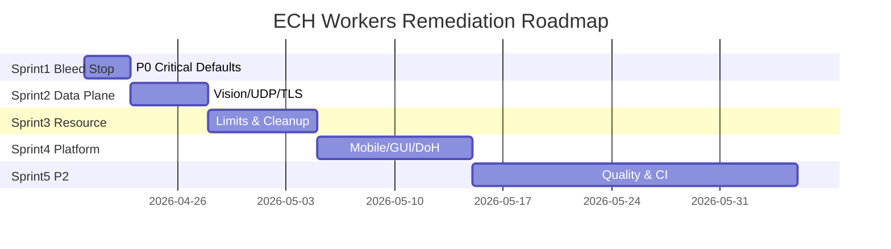
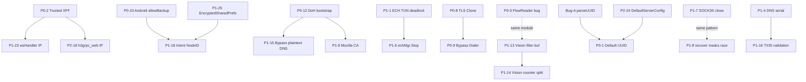
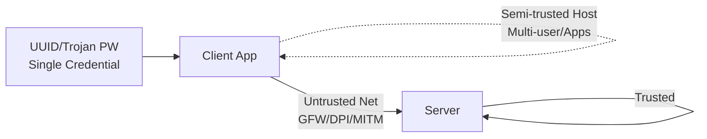

# ECH Workers Security Remediation Master Tracker / 安全审计修复总览

# ECH Workers 安全审计修复总览

**Security Remediation Master Tracker**

<user_quoted_section>本 spec 是修复工作的"指挥中心"。所有 89 个 ticket 均挂在本 spec 之下,LLM 修复时应先读本 spec 理解全局,再执行单个 ticket。</user_quoted_section>

## 1. Source / 数据来源

- 审计报告: file:33c26b4c-5dc0-45b8-b9ad-07b12ad5ad50-ECH_Workers_全栈安全与质量审计报告_`(P0_P1_P2).md`
- 审计版本: 2026-04-17
- 审计范围: `ewp-core` (Go) + `ewp-gui` (Qt6/C++) + `ewp-android` (Kotlin)
- 总发现: **89 项** (P0:12 / P1:30 / P2:40 / Bug:7)

## 2. How LLM Should Use This / LLM 修复使用指南

每个 ticket 均自包含,但应遵循以下顺序:

1. **先读本 spec** 理解优先级、依赖、Sprint 划分
2. **按 Sprint 顺序触发** ticket,避免回归
3. **检查 Dependencies 字段**: 若 ticket A 依赖 ticket B,B 未完成前不要启动 A
4. **修复时同步更新测试**: 每个 ticket 均包含验证方法,必须落地为单元测试或手工验证步骤
5. **关注 Regression Risk**: 高回归风险项需要额外的端到端冒烟测试

每个 ticket 包含 7 个标准字段:

- 📍 Location / 精确位置
- 💥 Reproduction / 复现条件
- 🔧 Fix / 修复方案 + 代码示例
- ✅ Acceptance Criteria / 验收标准
- 🧪 Verification / 验证方法
- 🔗 Dependencies / 依赖关系
- ⚠️ Regression Risk / 回归风险评估

## 3. Priority & Module Distribution / 优先级 × 模块分布

| Module \ Priority | P0 | P1 | P2 | Bug | 小计 |
| --- | --- | --- | --- | --- | --- |
| `ewp-core/cmd/server` | 5 | 2 | 4 | 1 (C) | 12 |
| `ewp-core/internal/server` | 1 | 4 | 1 | 1 (B) | 7 |
| `ewp-core/protocol` | 1 | 6 | 4 | 1 (G) | 12 |
| `ewp-core/transport` | 2 | 6 | 8 | 3 (E,F + 部分) | 19 |
| `ewp-core/common/tls` | 1 | 1 | 0 | 0 | 2 |
| `ewp-core/dns` + `tun` | 1 | 4 | 4 | 0 | 9 |
| `ewp-core/ewpmobile` + `option` | 1 | 2 | 2 | 0 | 5 |
| `ewp-android` | 1 | 4 | 5 | 0 | 10 |
| `ewp-gui` | 1 | 3 | 4 | 1 (D) | 9 |
| `.github/workflows` | 0 | 0 | 3 | 0 | 3 |
| `common/net` (TFO) | 0 | 0 | 1 | 0 | 1 |
| **Total** | **12** | **30** | **40** | **7** | **89** |

## 4. Sprint Roadmap / 修复路线图

### Sprint 1 — Immediate Bleed Stop (2-3 days) / 立即止血

**目标**: 移除可被远程立即利用的默认凭证、Header 信任、OOM 入口

- P0-1, P0-2, P0-5, P0-6, P0-10, P0-11, P1-23, P1-24

### Sprint 2 — Data Plane Correctness (3-5 days) / 数据面正确性

**目标**: 修复 Vision、UDP DNS、TLS Config 共享、leftover 等数据正确性 Bug

- P0-3, P0-4, P0-8, P0-9, P1-1, P1-7, P1-11, Bug-F, Bug-G

### Sprint 3 — Resource Exhaustion (1 week) / 资源耗尽

**目标**: 给所有 cache/pool/session 加上限,清理 goroutine 泄漏

- P0-7, P1-2, P1-3, P1-4, P1-5, P1-6, P1-8, P1-10, P1-12, P1-16, P1-28

### Sprint 4 — Platform Security & Defense Depth (1-2 weeks) / 平台与防御深度

**目标**: 移动端凭证加密、DoH 多源、Mozilla CA 强制、Vision 滤波改进

- P0-12, P1-9, P1-13, P1-14, P1-15, P1-17, P1-18, P1-19, P1-20, P1-21, P1-22, P1-25, P1-26

### Sprint 5 — P2 Quality + Supply Chain (Ongoing) / 质量与供应链

**目标**: 代码质量、性能、CI/CD 加固

- 所有 P2-1 ~ P2-40, P1-27, P1-29, P1-30, Bug-A, Bug-B, Bug-C, Bug-D, Bug-E

## 5. Cross-Ticket Dependency Graph / 跨工单依赖图

### 关键依赖说明:

- **P0-2 必须先完成** — P1-23、P2-18 才能引用统一的可信代理判定
- **P0-10 + P1-25 必须先完成** — P1-18 才能改 Intent 传 nodeId
- **P0-12 + P1-9 应同 Sprint** — DoH 与 CA 信任链耦合
- **Bug-A 应在 P0-1 之前考虑** — 确保 parseUUID 严格性与默认 UUID 移除一致
- **P0-8 应在 P0-9 之前** — TLS Config 隔离方案影响 BypassDialer 的复制策略

## 6. Architecture Trust Boundaries / 信任边界提醒

修复时必须维护这些信任边界:

- **客户端 ↔ 服务端网络是不可信的** → 所有协议字段必须考虑伪造与降级
- **客户端宿主机半可信** → 凭证存储必须加密、配置文件必须严格权限
- **UUID 泄露 = 完全失陷** → 所有日志、Intent、临时文件均不得明文出现

## 7. Full Ticket Index / 工单索引

### 🔴 P0 Critical (12)

| ID | Title | Module | Sprint |
| --- | --- | --- | --- |
| P0-1 | Remove Hardcoded Default UUID | cmd/server | 1 |
| P0-2 | Trusted Proxy CIDR for X-Forwarded-For | cmd/server | 1 |
| P0-3 | Vision FlowReader Direct-Copy Switch Bug | protocol/ewp | 2 |
| P0-4 | Async DNS in UDP Dispatch | internal/server | 2 |
| P0-5 | HTTP Body Truncation Silent Drop | protocol/http | 1 |
| P0-6 | XHTTP POST Body OOM | cmd/server | 1 |
| P0-7 | XHTTP Session Limit + LRU | cmd/server | 3 |
| P0-8 | Clone TLS Config to Avoid ECH Race | common/tls | 2 |
| P0-9 | WebSocket Local Dialer Clone | transport/websocket | 2 |
| P0-10 | Android allowBackup=false | ewp-android | 1 |
| P0-11 | GUI QTemporaryFile for Config | ewp-gui | 1 |
| P0-12 | DoH Multi-Source + Strict Mode | client / mobile | 4 |

### 🟠 P1 High (30)

| ID | Title | Module | Sprint |
| --- | --- | --- | --- |
| P1-1 | ECH BypassDialer in TUN Mode (Desktop) | cmd/client | 2 |
| P1-2 | H3-gRPC pendingBuf Backpressure | transport/h3grpc | 3 |
| P1-3 | UDP Session Cap Per User/IP | internal/server | 3 |
| P1-4 | TunnelDNSResolver Connection Pool | dns | 3 |
| P1-5 | Cache Capacity Limits | dns + transport/grpc | 3 |
| P1-6 | echMgr.Stop on vpnManager.Stop | ewpmobile | 3 |
| P1-7 | SOCKS5 udpSession sync.Once | protocol/socks5 | 2 |
| P1-8 | UDP chanWriter Race via sync.Once | internal/server | 3 |
| P1-9 | Mozilla CA Mandatory + Error Propagate | common/tls | 4 |
| P1-10 | gRPC Pool Cleanup | transport/grpc | 3 |
| P1-11 | Trojan UDP Resolve Failure → Close Session | internal/server | 2 |
| P1-12 | Unified ECH Error Detection (errors.As) | transport/* | 3 |
| P1-13 | Vision XtlsFilterTls Ring Buffer | protocol/ewp | 4 |
| P1-14 | Vision Counter Per-Direction | protocol/ewp | 4 |
| P1-15 | Bypass Resolver Default DoT/DoH | transport | 4 |
| P1-16 | Tunnel DNS TXID Validation | dns | 3 |
| P1-17 | Mobile ProtectSocket Failure → Error | ewpmobile | 4 |
| P1-18 | Intent Pass NodeId, Not Full JSON | ewp-android | 4 |
| P1-19 | GUI System Proxy PAC Coverage | ewp-gui | 4 |
| P1-20 | GUI ShareLink Strict Validation | ewp-gui | 4 |
| P1-21 | GUI Clipboard Import Confirmation | ewp-gui | 4 |
| P1-22 | SOCKS5 UDP Source Port Validation | protocol/socks5 | 4 |
| P1-23 | wsHandler ClientIP Unification | cmd/server | 1 |
| P1-24 | Server TLS MinVersion = 1.3 | cmd/server | 1 |
| P1-25 | Android EncryptedSharedPreferences | ewp-android | 4 |
| P1-26 | crypto/rand Error Handling | protocol/ewp | 4 |
| P1-27 | BypassResolver probeBestIP Fingerprint | transport | 5 |
| P1-28 | H3-gRPC Decode Error Tolerance | transport/h3grpc | 3 |
| P1-29 | Fake Response Length Statistical Distinguishability | protocol/ewp | 5 |
| P1-30 | FakeIP IPv6 Pool Expansion | dns | 5 |

### 🟡 P2 Medium/Low (40)

| ID | Title | Module |
| --- | --- | --- |
| P2-1 | NonceCache Key Include UUID Hash | protocol/ewp |
| P2-2 | DecodeAddress Domain ASCII Validation | protocol/ewp |
| P2-3 | DNS BuildQuery Random TXID | dns |
| P2-4 | DNS Compression Pointer Robustness | dns |
| P2-5 | Reverse Mapping Doubly-Linked List | dns |
| P2-6 | Bufferpool Origin Validation | common/bufferpool |
| P2-7 | Server Top-Level Panic Recover | cmd/server |
| P2-8 | IsNormalCloseError Use errors.Is | protocol |
| P2-9 | HTTP Strict ABNF Parsing | protocol/http |
| P2-10 | HTTP Keep-Alive Support | protocol/http |
| P2-11 | h3grpc SetSNI Return Error | transport/h3grpc |
| P2-12 | gRPC Conn StartPing Semantics | transport/grpc |
| P2-13 | gRPC Conn.Close Cancel RecvMsg | transport/grpc |
| P2-14 | WebSocket Conn.Write Mutex | transport/websocket |
| P2-15 | XHTTP isIPAddress IPv6 Brackets | transport/xhttp |
| P2-16 | TUN HandleTCP Idle Deadline | tun |
| P2-17 | gVisor WritePackets BufferPool | tun/gvisor |
| P2-18 | h3grpc_web ClientIP Unification | internal/server |
| P2-19 | XHTTP Download Polling → CondVar | cmd/server |
| P2-20 | XHTTP StreamOne Header Constants | cmd/server |
| P2-21 | XHTTP SessionID Use crypto/rand | transport/xhttp |
| P2-22 | XHTTP xmux Use math/rand | transport/xhttp |
| P2-23 | parseUUID Reject Nil UUID | option |
| P2-24 | Remove DefaultServerConfig UUID | option |
| P2-25 | Client SIGHUP Reload | cmd/client |
| P2-26 | Android ui-test-manifest Release Check | ewp-android |
| P2-27 | Android Proguard Specific Methods | ewp-android |
| P2-28 | Android networkSecurityConfig Cleartext | ewp-android |
| P2-29 | Android monitorVPN 5-10s Interval | ewp-android |
| P2-30 | Android QUERY_ALL_PACKAGES On-Demand | ewp-android |
| P2-31 | GUI Quit Menu / Shortcut | ewp-gui |
| P2-32 | GUI Settings Auto-Restart Core | ewp-gui |
| P2-33 | GUI Reconnect Backoff Jitter | ewp-gui |
| P2-34 | GUI System Proxy Save Original State | ewp-gui |
| P2-35 | CI Gradle Wrapper Validation | .github |
| P2-36 | CI Cosign Sign-Blob | .github |
| P2-37 | CI Token Not in URL | .github |
| P2-38 | TFO Actual Activation | common/net |
| P2-39 | /health Endpoint LAN-only | cmd/server |
| P2-40 | UUID[:] Cross-Goroutine Lifetime | internal/server |

### 🔵 Bug Findings (7)

| ID | Title | Module |
| --- | --- | --- |
| Bug-A | parseUUID Accept 32-Hex Without Dashes | server + transport |
| Bug-B | EWP UDP Keep Packet initTarget Race | internal/server |
| Bug-C | XHTTP Handshake Response Timing | cmd/server |
| Bug-D | ConfigGenerator use_mozilla_ca Roundtrip | ewp-gui |
| Bug-E | StreamDownConn Trojan UDP Branch | transport/xhttp |
| Bug-F | StreamOne EWP Handshake Leftover | transport/xhttp |
| Bug-G | FlowReader state==nil Leftover Lost | protocol/ewp |

## 8. Master Acceptance Criteria / 总验收标准

完成全部 89 个 ticket 后,项目应满足:

所有 P0 项均已修复并通过单元测试所有 P1 项均已修复或有明确 backlogCI 引入 race detector + fuzz(EWP/Trojan handshake)引入 SLSA Level 2 + cosign 签名Android: allowBackup=false, EncryptedSharedPrefs, networkSecurityConfigServer: 启动强制 UUID,TLS 1.3 only,trusted_proxies CIDR关键路径(EWP Handshake / Vision Flow / TUN Bypass)有 e2e 测试
